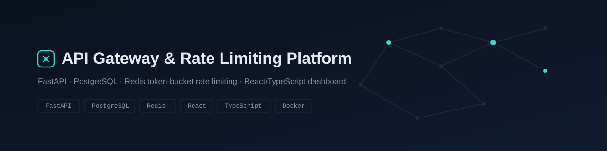
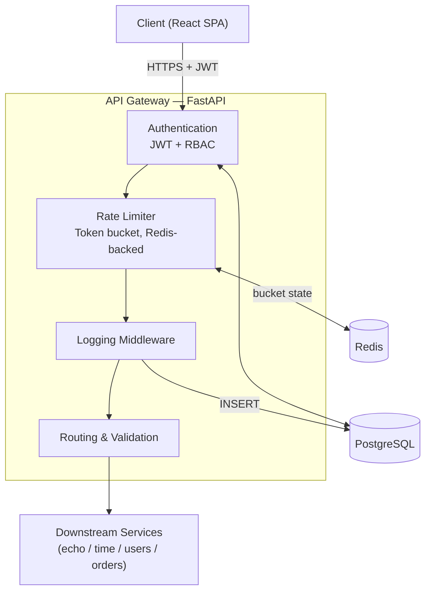
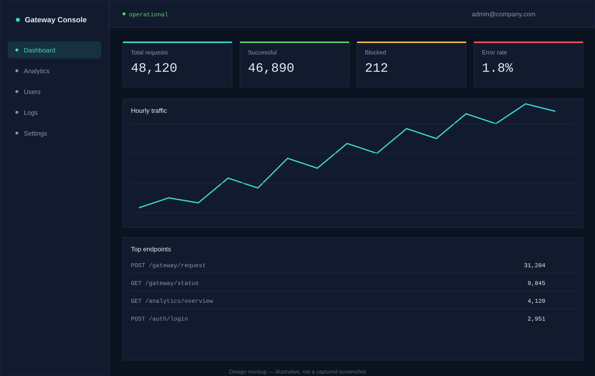

<p align="center">
  
</p>

<p align="center">
  <a href="https://github.com/OWNER/REPO/actions/workflows/ci.yml"></a>
  
  
  <a href="LICENSE"></a>
</p>

> Replace `OWNER/REPO` in the badge URL above once this is pushed to GitHub.

A production-shaped API Gateway: JWT auth with RBAC, a Redis-backed
token-bucket rate limiter, request logging, and an analytics/admin
dashboard, fronted by a React console. Built as an SDE-1 portfolio
piece — see [`docs/`](docs/) for the full design writeup of every
piece.

## Contents

- [Features](#features)
- [Architecture](#architecture)
- [Tech stack](#tech-stack)
- [Installation](#installation)
- [Docker quick start](#docker-quick-start)
- [API documentation](#api-documentation)
- [Testing](#testing)
- [Screenshots](#screenshots)
- [Deployment](#deployment)
- [Project structure](#project-structure)
- [Future improvements](#future-improvements)

## Features

- **JWT authentication** — register/login/refresh with **token rotation**, bcrypt password hashing, role-based access control (admin/user)
- **API Gateway** — validates, authenticates, and routes requests to a registered-service table, tracking response time on every call
- **Rate limiting** — token bucket algorithm, Redis-backed and atomic (Lua script, closes the read-modify-write race a plain GET/SET would have), configurable per user and per endpoint
- **Logging** — every request persisted (user, endpoint, method, status, response time, IP, timestamp) via middleware, not opt-in per route
- **Analytics & Admin dashboard** — traffic over time, top/slowest endpoints, most active users, paginated log/user browsing — all admin-gated
- **React dashboard** — dark-mode-first ops console, role-aware (admins see the dashboard; regular users get an interactive gateway playground), built with Recharts + Tailwind
- **85 backend tests**, Dockerized full stack, GitHub Actions CI, deployment guide for Render + Vercel + Upstash

## Architecture



Full system diagram, request-flow sequence diagram, auth-flow sequence
diagram, and the database ER diagram all live in
[`docs/diagrams.md`](docs/diagrams.md) and
[`docs/database/er-diagram.md`](docs/database/er-diagram.md).

## Tech stack

| Layer | Choices |
|---|---|
| Backend | Python 3.11, FastAPI, SQLAlchemy 2.0, Alembic, Pydantic v2 |
| Database | PostgreSQL 15 (7 normalized tables — see [`docs/database`](docs/database)) |
| Cache / rate limiting | Redis 7, token bucket via Lua script |
| Auth | JWT (python-jose), bcrypt (passlib) |
| Frontend | React 18, TypeScript, Vite, Tailwind CSS, Recharts, Axios |
| Testing | pytest, pytest-cov — 85 tests |
| DevOps | Docker, Docker Compose, GitHub Actions, Render, Vercel, Upstash |

## Installation

### Prerequisites

- Python 3.11+, Node 20+
- A running PostgreSQL instance and Redis instance (local installs, or skip straight to [Docker](#docker-quick-start))

### Backend

```bash
cd backend
python -m venv venv
venv\Scripts\activate          # Windows — use `source venv/bin/activate` on macOS/Linux
pip install -r requirements.txt
copy .env.example .env         # Windows — use `cp .env.example .env` on macOS/Linux
# edit .env: set DATABASE_URL and REDIS_URL to your local instances
alembic upgrade head
uvicorn app.main:app --reload
```

Backend now running at `http://localhost:8000` (`/docs` for Swagger UI, `/health` to verify DB+Redis connectivity).

### Frontend

```bash
cd frontend
npm install
copy .env.example .env         # Windows — use `cp .env.example .env` on macOS/Linux
npm run dev
```

Frontend now running at `http://localhost:5173`.

## Docker quick start

One command for the whole stack (Postgres + Redis + backend + frontend):

```bash
cp .env.example .env
docker compose up --build
```

- Frontend: `http://localhost:3000`
- Backend: `http://localhost:8000` (`/docs`, `/health`)

Full explanation of how the containers connect and startup ordering:
[`docs/docker.md`](docs/docker.md).

## API documentation

Interactive Swagger UI is always live at `/docs` on a running backend.
For a hand-written reference with example `curl` requests and JSON
responses for every endpoint (auth, gateway, analytics, admin), see
[`docs/api.md`](docs/api.md).

| Group | Endpoints |
|---|---|
| Auth | `POST /auth/register`, `POST /auth/login`, `POST /auth/refresh`, `GET /auth/me` |
| Gateway | `POST /gateway/request`, `GET /gateway/status` |
| Analytics *(admin)* | `GET /analytics/overview`, `GET /analytics/traffic`, `GET /analytics/endpoints` |
| Admin *(admin)* | `GET /admin/users`, `GET /admin/logs`, `GET /admin/blocked` |
| Health | `GET /health` |

## Testing

```bash
cd backend
pytest -v                                              # 85 tests
pytest --cov=app --cov-report=term-missing --cov-report=html   # coverage report
```

Uses a temp-file SQLite DB and an in-memory fake Redis — no live
Postgres/Redis needed to run the suite. Full breakdown of what's
covered: [`docs/testing.md`](docs/testing.md).

## Screenshots

<p align="center">
  
</p>

The image above is a design mockup, not a captured screenshot — this
project was built without the ability to actually run the frontend
and backend together in the environment that generated it (see
[`screenshots/README.md`](screenshots/README.md) for the honest
explanation and instructions for adding real screenshots once you have
it running).

## Deployment

Backend → Render, frontend → Vercel, Postgres → Render managed, Redis
→ Upstash. Exact step-by-step instructions, a `render.yaml` blueprint,
and a post-deploy verification checklist: [`docs/deployment.md`](docs/deployment.md).

## Project structure

```
api-gateway-platform/
├── backend/
│   ├── app/
│   │   ├── routes/        # auth, gateway, analytics, admin
│   │   ├── services/      # business logic: auth, gateway routing, rate limiter, analytics
│   │   ├── middleware/    # error handling, request logging, rate-limit enforcement
│   │   ├── models/        # SQLAlchemy models (7 tables)
│   │   ├── schemas/       # Pydantic request/response schemas
│   │   ├── database/      # engine, session, declarative base
│   │   ├── utils/         # auth dependencies, logger
│   │   └── tests/         # 85 tests
│   ├── alembic/           # migrations
│   └── Dockerfile
├── frontend/
│   └── src/
│       ├── api/           # typed Axios client + per-resource API modules
│       ├── context/       # auth + theme React contexts
│       ├── components/    # Layout, ProtectedRoute, StatCard, GatewayPlayground
│       └── pages/         # Login, Register, Dashboard, Analytics, Users, Logs, Settings
├── docs/                  # database schema/ER, diagrams, API reference, Docker, testing, deployment
├── .github/                # CI workflow, issue/PR templates
├── docker-compose.yml
└── render.yaml
```

## Future improvements

Honest list of what a v2 would add, roughly in priority order:

- **Scheduled `endpoint_stats` rollups** — currently analytics aggregates `request_logs` directly on every call; a cron/Celery-beat job pre-aggregating into the (already-schema'd) `endpoint_stats` table would matter at real traffic volume
- **Refresh-token reuse detection** — rotation is implemented (Phase 4), but detecting *reuse of an already-rotated token* as a signal of theft (and revoking the whole session family) isn't
- **API key auth** — the `api_keys` table exists in the schema but isn't wired to an actual auth path yet; only JWT bearer tokens work today
- **httpOnly cookie storage** for tokens instead of `localStorage`, to reduce XSS blast radius
- **Real downstream services** — the gateway's service registry currently routes to in-process mock handlers (`echo`/`time`/`users`/`orders`); a real deployment would proxy to actual independent services over HTTP
- **WebSocket live updates** for the dashboard instead of polling
- **npm lockfile** committed, so CI can use `npm ci` instead of `npm install`

## License

MIT — see [LICENSE](LICENSE).
"# fastapi-api-gateway" 
