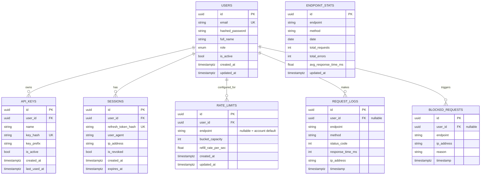

# Database ER Diagram

## Normalization notes

- **3NF throughout.** No repeating groups; every non-key column depends only on its table's primary key.
- `RATE_LIMITS.endpoint` is nullable by design (not a separate "default limits" table) — a NULL row is the account-wide default, an override row targets one endpoint. The unique constraint `(user_id, endpoint)` still holds because Postgres treats each NULL as distinct, so a user can have at most one override per named endpoint plus one default.
- `REQUEST_LOGS` and `BLOCKED_REQUESTS` are kept separate rather than one table with a status flag, because they're queried independently at high volume (all requests vs. only rejections) and have different retention/aggregation needs.
- `ENDPOINT_STATS` is a derived/denormalized rollup of `REQUEST_LOGS`, intentionally — it exists purely so the analytics dashboard doesn't scan the full log table on every page load.
- Foreign keys use `ON DELETE CASCADE` for owned child rows (api_keys, sessions, rate_limits — deleting a user removes their own config) and `ON DELETE SET NULL` for historical logs (request_logs, blocked_requests — deleting a user preserves the audit trail).
