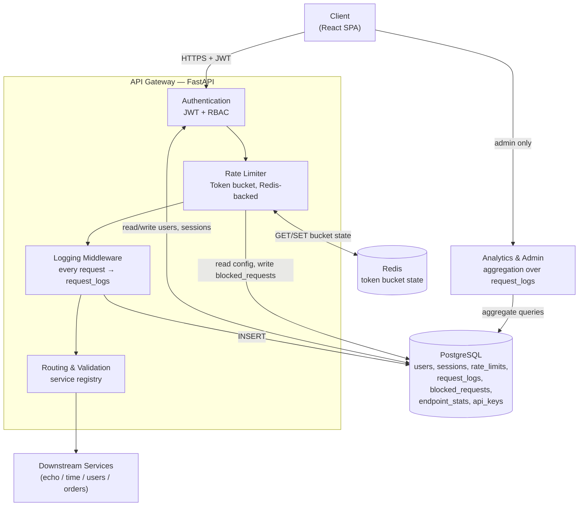
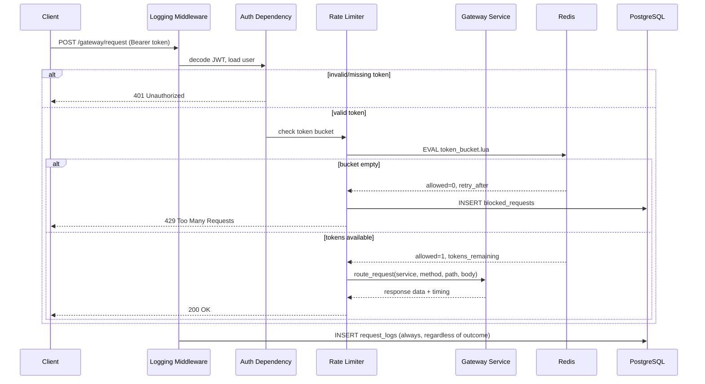
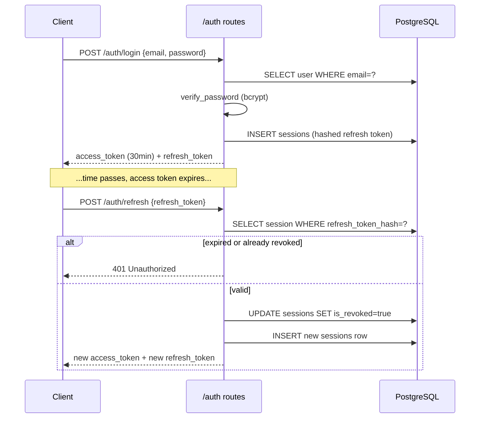
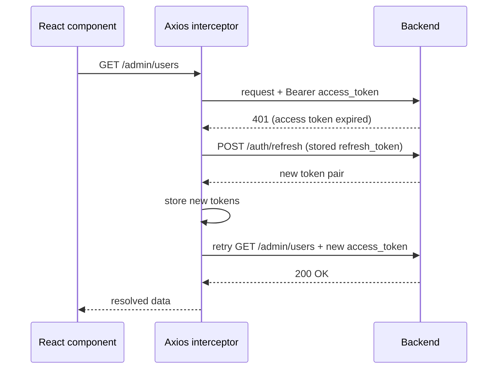

# Diagrams

All diagrams here are Mermaid, so they render natively in GitHub's
Markdown viewer — no image files to keep in sync with the architecture.
The database ER diagram lives separately at
[`docs/database/er-diagram.md`](./database/er-diagram.md).

## System architecture

## Request flow (a single gateway call)

What actually happens, in order, for `POST /gateway/request`:

## Auth flow (login + refresh rotation)

## Frontend auth interceptor (why a 401 doesn't just fail)

