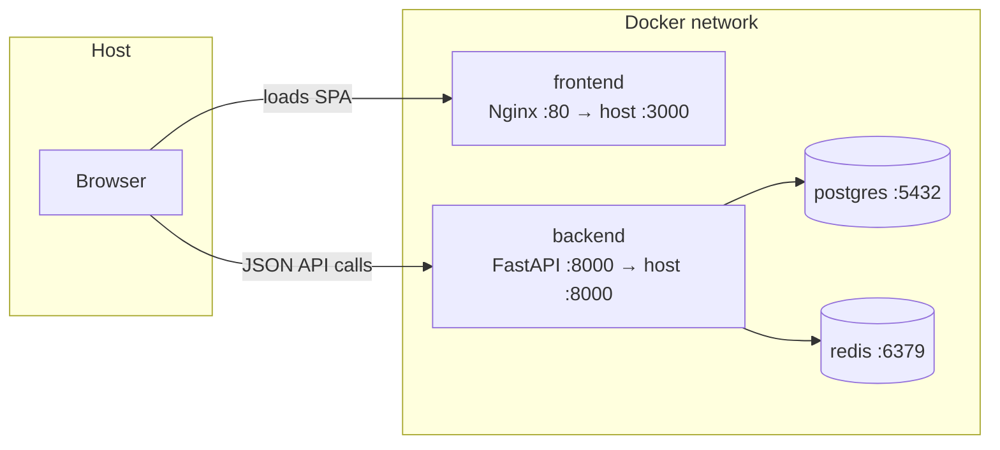

# Docker Setup

One command brings up the whole stack: Postgres, Redis, the FastAPI
backend, and the React frontend served by Nginx.

## Quick start

```bash
cp .env.example .env     # adjust secrets/ports if needed
docker compose up --build
```

- Frontend: http://localhost:3000
- Backend API docs: http://localhost:8000/docs
- Backend health check: http://localhost:8000/health

First boot takes a bit longer — Postgres has to report healthy, then
the backend container runs `alembic upgrade head` (via
`docker-entrypoint.sh`) before `uvicorn` starts. Watch the logs:

```bash
docker compose logs -f backend
```

## How the pieces connect



The frontend container only *serves* static files — the browser talks
to the backend directly over `VITE_API_BASE_URL`, not through Nginx as
a reverse proxy. That env var is baked into the frontend's JS bundle
at **build time** (Vite inlines `VITE_*` vars), so if you change the
backend's published port, rebuild the frontend image rather than just
restarting the container.

## Service startup order

`depends_on` with `condition: service_healthy` enforces:

1. `postgres` and `redis` must both report healthy (their own
   `HEALTHCHECK`s — `pg_isready` / `redis-cli ping`) before...
2. `backend` starts. Its container then runs migrations (with a
   10-attempt retry loop — "accepting connections" and "ready for a
   schema migration" aren't always the exact same instant) before
   starting Uvicorn, and the backend's own `/health`-based
   `HEALTHCHECK` must pass before...
3. `frontend` starts.

## Individual images

```bash
# Backend only
docker build -t gateway-backend ./backend
docker run -p 8000:8000 --env-file backend/.env gateway-backend

# Frontend only (API URL must be known at build time)
docker build -t gateway-frontend ./frontend --build-arg VITE_API_BASE_URL=http://localhost:8000
docker run -p 3000:80 gateway-frontend
```

## Common issues

| Symptom | Fix |
|---|---|
| Backend restarts in a loop | Check `docker compose logs backend` — almost always a migration failure. Confirm `postgres` is healthy: `docker compose ps`. |
| Frontend loads but API calls fail (CORS or network error) | `VITE_API_BASE_URL` was wrong *at build time*. Rebuild: `docker compose up --build frontend`. |
| `psycopg2` build fails | Only relevant if you're not using the provided Dockerfile — it already installs `gcc`/`libpq-dev` for this. |
| Port already in use | Another process is on 3000/8000/5432/6379. Change the left-hand side of the `ports:` mapping in `docker-compose.yml` (e.g. `"3001:80"`). |
